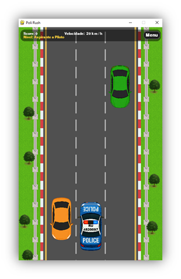

<<<<<<< HEAD
# PoliRush
Jogo de corrida em Python
=======
# PoliRush 🚓

Jogo de corrida 2D em Python com Pygame.  
Desvie dos carros e tente chegar o mais longe possível!



## Como Rodar o Jogo direto no computador
Rode o arquivo de execução direto para jogar

## Para rodar o jogo em uma IDE
### 1. Tenha Python 3.8+ e Pygame instalado:
```bash
pip install pygame
```
### 2. Entre na pasta do projeto (substitua pelo caminho correto):
```bash
cd caminho/para/PoliRush
```

### 3. Rode o jogo:
```bash
python main.py
```
ou, se no Linux/macOS:
```bash
python3 main.py
```

## Como Jogar
```bash
Controles
Ação	Tecla
Começar o jogo	Click / Enter / Space
Mover pra esquerda	Seta ←
Mover pra direita	Seta →
Voltar ao menu	Botão   "Menu"
```

Divirta-se! 🚓💨
>>>>>>> 20f75dd (Commit Inicial)
